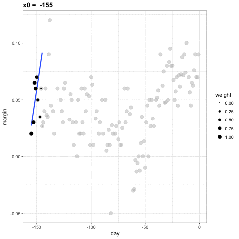

## Bienvenida
-  ¡Bienvenidos al curso de Series de Tiempo y Modelos Econometricos!
-  Instructor: Fernando Salcedo Mejía Eco, Ms
-  Escuela de Transformación Digital - ETD | Programa de Ciencia de Datos

## Acerca del curso
- Objetivo: Conceptos fundamentales de los modelos de series de tiempo y las habilidades técnicas y prácticas modernas para su aplicación.
- Metodología: Combinación de teoría y práctica con ejemplos en R y Python.

## Objetivos de aprendizaje
- Propiedades de una serie de tiempo. Componentes, descomposición y pronostico.
- Modelos SARIMAX y ARCH/GARCH.
- Modelos de detección de anomalías.
- Modelos de redes neuronales, Long Short-Term Memory y Prophet.

## Recursos adicionales {.smaller}
- Material del curso disponible en GitHub: [Repositorio del curso](https://github.com/fersalme/regresion-lineal-series-tiempo)
* **Enders, Walter (2004).** *Applied econometric time series*. Wiley.
* **Ao, Sio-Iong (2010).** *Applied time series analysis and innovative computing*. Springer.
* **Palit, Ajoy K. (2005).** *Computational intelligence in time series forecasting: theory and engineering applications*. Springer.
* **Ghysels, Eric (2001).** *The econometric analysis of seasonal time series*. Cambridge University.
* **Box, George E. P. (1994).** *Time series analysis forecasting and control*. Prentice-Hall.
* **IntechOpen (2024).** *Time Series Analysis: Recent Advances, New Perspectives and Applications*.
* **Cipra, Tomas (2020).** *Time Series in Economics and Finance*. Springer International Publishing.
* **Hyndman, R.J., & Athanasopoulos, G. (2021)** *Forecasting: principles and practice, 3rd edition, OTexts: Melbourne, Australia. Available at: OTexts.com/fpp3.*
* **Hyndman, R.J., Athanasopoulos, G., Garza, A., Challu, C., Mergenthaler, M., & Olivares, K.G. (2025).** Forecasting: Principles and Practice, the Pythonic Way. OTexts: Melbourne, Australia. Available at: OTexts.com/fpppy.

## Evaluación
- **Taller cada sesión**
    - Nota por sustentar taller : 50%
    - Notas por responder a preguntas en sustentación : 30%
    - Notas por participar en sustentaciones : 20%
- **Nota sesión:** $Puntaje final = 0.5 \times N1 + 0.3 \times N2 + 0.2 \times N3$
- **Nota final del curso:** Promedio de las notas de las tres sesiones.

## Políticas del curso
- Asistencia: Se espera asistencia regular a las clases y participación activa.
- Entrega de trabajos: Todos los trabajos deben entregarse en las fechas establecidas.
- Honestidad académica: Se espera que todos los estudiantes mantengan los más altos estándares de integridad académica. El plagio y la copia no serán tolerados.
- Uso de software: Se utilizarán R (quarto) y Python (Jupyter).
- Entregas de trabajos y proyectos en HTML generados desde quarto o Jupyter.
- Uso de IA Generativa: El uso de herramientas de IA generativa está permitido para apoyo en la comprensión de conceptos y generación de código, siempre y cuando se cite adecuadamente y no se utilice para la realización completa de tareas o exámenes.

## Paquetes de software requeridos
- R (principalmente) y Python
- Paquetes están listados en los archivos `r-requirements.txt` y `py-requirements.txt` en el repositorio del curso.
- Se recomienda crear un entorno virtual para instalar los paquetes necesarios si estás en tu pc. Si no usar **colab**.
- Instalar paquetes:
    - Python : `pip install -r py-requirements.txt`
    - R : `install.packages(grep("^#|^\\s*$", readLines("r-requirements.txt"), value = TRUE, invert = TRUE))` para instalar paquetes desde `r-requirements.txt`.

## Información de contacto
- Microsoft-Teams y correo electrónico : fsalcedo@utb.edu.co

## Series de Tiempo : Conceptos y fundamentos {background-color="#b42727"}

## Concepto y definición de series de tiempo

::: {.callout-tip title = "Concepto clave"}
- Una serie de tiempo es una secuencia de datos medidos en puntos sucesivos en el tiempo, generalmente a intervalos uniformes.
:::

- Las series de tiempo son comunes en diversas disciplinas, incluyendo economía, finanzas, meteorología, ingeniería y ciencias sociales.

- Formalmente $Y_t : \{y_1, y_2, \dots , y_T\}$ donde conocemos los valores de la serie hasta $T$.

## ¿Por qué estudiar series de tiempo?

- El objetivo principal del análisis de series de tiempo es modelar la estructura temporal de los datos para entender su comportamiento y hacer **pronósticos futuros**, clave para una **planificación eficaz y eficiente**.

- Según Hyndman y Athanasopoulos (2021) las condiciones para estudiar las series de tiempo con fines de pronóstico son:
  - Qué tanto entendemos los factores que mueven la serie
  - Cuánta información tenemos sobre la serie
  - Qué tanto se parece el futuro al pasado
  - Si los pronósticos pueden afectar aquello que intentamos pronosticar. (expectativas)

- Aplicaciones prácticas en diversos campos:
  - Finanzas: precios de acciones, tasas de interés.
  - Economía: PIB, inflación, desempleo.
  - Meteorología: temperaturas, precipitaciones.
  - Salud pública: tasas de enfermedades, hospitalizaciones.
  - Industria: control de calidad, mantenimiento predictivo.

## Tipos de datos en series de tiempo

- Datos de alta frecuencia: datos recogidos en intervalos muy cortos (segundos, minutos).
- Datos de baja frecuencia: datos recogidos en intervalos más largos (días, meses, años).
- Datos estacionarios: propiedades estadísticas constantes en el tiempo (media, varianza).
- Datos no estacionarios: propiedades estadísticas que cambian con el tiempo (tendencias, estacionalidad).

## Graficar del PIB de Colombia (1960-2024) R
```{r}
library(wbstats)
library(ggplot2)

# Descargar datos de la serie de tiempo
data <- wb_data(indicator = 'NY.GDP.MKTP.CD', country = 'COL', start_date = 1960, end_date = 2024)
data <- data[, c('date', 'NY.GDP.MKTP.CD')]
colnames(data) <- c('Año', 'PIB')

# Crear el gráfico de línea
ggplot(data, aes(x = Año, y = PIB)) +
  geom_line(color = 'steelblue') +
  geom_point(color = 'steelblue') +
  labs(title = 'Producto Interno Bruto (PIB) de Colombia (1960-2024)',
       x = 'Año',
       y = 'PIB en dólares estadounidenses') +
       theme_bw()
```

## Características y componentes de las series de tiempo

::: {.callout-tip title = "Concepto clave"}
- Las series de tiempo pueden descomponerse en varios componentes principales:
- Tendencia: dirección general a largo plazo de la serie. Puede ser creciente, decreciente o constante.
- Estacionalidad: patrones que se repiten en intervalos regulares (diarios, mensuales, anuales). Está asociada a factores climáticos, sociales o económicos esperados.
- Ciclos: fluctuaciones a largo plazo que no son de naturaleza estacional. Usualmente asociadas a ciclos económicos.
- Ruido: variabilidad aleatoria e impredecible en los datos.
:::

- La forma como se relacionan estos componentes determina la estructura de la serie de tiempo y guía la elección de modelos adecuados para su análisis.
- Tenemos una forma general para representar una serie de tiempo:
- Aditiva: $Y_t = T_t + S_t + C_t + e_t$
- Multiplicativa: $Y_t = T_t \times S_t \times C_t \times e_t$ en términos logarítmicos se convierte en aditiva.
- Donde $T_t$ es la tendencia, $S_t$ es la estacionalidad, $C_t$ son los ciclos y $e_t$ es el ruido.

{width=80%}

## Estacionalidad en series de tiempo

- La estacionalidad es un patrón que se repite en intervalos regulares dentro de una serie de tiempo.
- Ejemplos comunes de estacionalidad incluyen:
  - Ventas minoristas que aumentan durante la temporada navideña.
  - Aumento de la demanda de energía durante los meses de verano o invierno.
  - Fluctuaciones en la agricultura debido a las estaciones del año.
- La estacionalidad puede ser diaria, semanal, mensual o anual, dependiendo del contexto de la serie de tiempo.

{width=80%}

## Media móvil para estimar tendencia

:::{.callout-tip title = "Concepto clave"}
- La media móvil es una técnica sencilla para suavizar una serie de tiempo y estimar su componente de tendencia. La media móvil ayuda a reducir la variabilidad de corto plazo y resaltar la tendencia subyacente en los datos.
:::

Un MA (Moving average smoothing) de orden $m$ se define como :

$$
\hat{T}_{t} = \frac{1}{m} \sum_{j=-k}^k y_{t+j} \\
m = 2k + 1
$$

- Es decir, la estimación del ciclo de tendencia en el instante $t$ se obtiene promediando los valores de la serie temporal dentro de $k$ periodos de $t$. 
- Por lo tanto, el promedio elimina parte de la aleatoriedad de los datos, dejando un componente de ciclo de tendencia suave.


| Tiempo |**Serie original**|**Media móvil (k=3)**|**Media móvil (k=5)**|
|-----|------------------|----------------------|----------------------|
| 1 |  10 |  -  |  -  |
| 2 |  12 |  -  |  -  |
| 3 |  13 |  (10 + 12 + 13)/3 = 11.67  |  -  |
| 4 |  12 |  (12 + 13 + 12)/3 = 12.33  |  -  |
| 5 |  14 |  (13 + 12 + 14)/3 = 12.33  |  (10 + 12 + 13 + 12 + 14)/5 = 12.20   |
| 6 |  15 |   (12 + 14 + 15)/3 = 13.67   |   (12 + 13 + 12 + 14 + 15)/5 = 13.20   |
| 7 |  16 |   (14 + 15 + 16)/3 = 15.00   |   (13 + 12 + 14 + 15 + 16)/5 = 14.00   |
| 8 |  18 |   (15 + 16 + 18)/3 = 16.33   |   (12 + 13 + 14 + 15 + 16)/5 = 14.00   |

## Ejemplo de media móvil en R
```{r}
# librerias
library(readr)
library(dplyr)
library(ggplot2)
library(tsibble)
library(ggtime)
library(lubridate)
library(slider)

# datos
desempleo <- read_csv2("data/Mercado laboral y población.csv", col_select = 1:2)
# temporalidad
desempleo <- desempleo |>
    mutate(`Periodo(MMM, AAAA)` = yearmonth(`Periodo(MMM, AAAA)`)) |>
    as_tsibble(index = `Periodo(MMM, AAAA)`)

# media movil
desempleo <- desempleo |> 
    mutate(
        # before = 3 significa: el dato actual + 3 anteriores = ventana de 4
        # complete = TRUE : ventana completa de 4 observaciones
        ma_k4 = slide_mean(`Tasa de desempleo - total nacional`, before = 3, complete = TRUE),
        ma_k6 = slide_mean(`Tasa de desempleo - total nacional`, before = 5, complete = TRUE),
        ma_k12 = slide_mean(`Tasa de desempleo - total nacional`, before = 11, complete = TRUE)
    )

# graficar
autoplot(desempleo, colour = "gray") +
geom_line(aes(y = ma_k4, color = "MA-4")) +
geom_line(aes(y = ma_k6, color = "MA-6")) +
geom_line(aes(y = ma_k12, color = "MA-12")) +
labs(color = "MA-orden")

```

## Media móvil para estimar tendencia

- La elección de la amplitud o ventana ($K$) para una media móvil es un equilibrio entre suavizado (quitar ruido) y reacción (no perder cambios importantes).
- La recomendación más común es alinear $K$ con el ciclo natural de tus datos para eliminar el ruido estacional.

    - Datos Trimestrales: K=4
    - Datos Mensuales: K=12
    - Datos Diarios: Usa K=7 (semanal) o K=30 (mensual).

## Métodos para descomponer series de tiempo

- Descomposición clásica: separa la serie en sus componentes aditivos o multiplicativos utilizando medias móviles.
- STL (Seasonal and Trend decomposition using Loess): método robusto que utiliza regresión local para estimar tendencia y estacionalidad.

## Descomposición aditiva de series de tiempo

- Se utiliza cuando la amplitud de las variaciones estacionales se mantiene constante a lo largo del tiempo, independientemente del nivel de la serie.

$$
Y_t = T_t + S_t + R_t
$$

- La descomposición clásica de una serie $Y_t$ implica los siguientes pasos:
  - Estimar la tendencia utilizando una media móvil. $T_t = SMA_k(Y_t)$
  - Calcular la serie **sin tendencia** restando la tendencia de la serie original. $Y_t - T_t$
  - Estimar la estacionalidad $S_t$ promedia los valores sin tendencia para cada período estacional (meses, trimestres, etc.).
  - Calcular los residuos restando la tendencia y la estacionalidad de la serie original. $R_t = Y_t - T_t - S_t$

## Descomposición clásica de series de tiempo multiplicativas

- Se utiliza cuando la amplitud de las variaciones estacionales aumenta o disminuye proporcionalmente con la tendencia.

$$
Y_t = T_t \times S_t \times R_t
$$

- La descomposición clásica multiplicativa de una serie $Y_t$ implica los siguientes pasos:
  - Estimar la tendencia utilizando una media móvil. $T_t = SMA_k(Y_t)$
  - Calcular la serie **sin tendencia** dividiendo la serie original por la tendencia. $Y_t / T_t$
  - Estimar la estacionalidad $S_t$ promedia los valores sin tendencia para cada período estacional (meses, trimestres, etc.).
  - Calcular los residuos dividiendo la serie original por la tendencia y la estacionalidad. $R_t = Y_t / (T_t \times S_t)$


## Descomposición STL (Seasonal and Trend decomposition using Loess)


- STL es un método versátil y robusto para la descomposición de series temporales. STL es un acrónimo de Descomposición estacional y de tendencias mediante LOESS, donde LOESS es un método para estimar relaciones no lineales.

- **Siempre es aditiva**, por lo que en series multiplicativas se convierte en una serie aditiva aplicando primero una transformación de Logaritmo (Transformación Box-Cox).

-  Cleveland, R. B., Cleveland, W. S., McRae, J. E., & Terpenning, I. J. (1990). STL: A seasonal-trend decomposition procedure based on loess. Journal of Official Statistics, 6(1), 3–33. 

## Local weighted regression

$$
E[Y_i | X_i = x_i ] = \beta_0 + \beta_1 (x_i-x_0) \mbox{   si   }  |x_i - x_0| \leq h
$$

- Utilice una ventana deslizante para dividir los datos en grupos más pequeños.
- En cada punto de datos, utilice un método de mínimos cuadrados ponderados para ajustar una línea.
- Para reducir la influencia en la nueva curva, creamos un peso adicional para los mínimos cuadrados ponderados en función de la distancia entre el punto original y el nuevo punto.
- Continuar hasta recorrer todos los datos.

## Local weighted regression algoritmo de estimación.

{width="100%"}


## Transformación Box-Cox

- La transformación de Box-Cox es un método estadístico utilizado para modificar la distribución de los datos con el objetivo de que se aproximen más a una distribución normal y, especialmente en series de tiempo, para estabilizar la varianza (homocedasticidad).

- La transformación depende de un parámetro llamado $\lambda$ (lambda). Para una variable $y_t$​ (que debe ser estrictamente positiva), la transformación se define como:

$$
y(\lambda) = \begin{cases} 
\dfrac{y^\lambda - 1}{\lambda} & \text{si } \lambda \neq 0 \\[10pt] 
\ln(y) & \text{si } \lambda = 0 
\end{cases}
$$

| **Valor λ** | **Tipo de transformación** | **Ecuación** |
|:-----------:|:-------------------------:|:------------:|
| -2 | Cuadrado recíproco | $y' = \frac{1}{y^2}$ |
| -1 | Recíproco | $y' = \frac{1}{y}$ |
| -0.5 | Raíz cuadrada recíproca | $y' = \frac{1}{\sqrt{y}}$ |
| 0 | Logaritmo natural (ln y) | $y' = \ln(y)$ |
| 0.5 | Raíz cuadrada | $y' = \sqrt{y}$ |
| 1 | Sin transformación (identidad) | $y' = y$ |
| 2 | Cuadrado | $y' = y^2$ |

- La transformación logarítmica ($\lambda=0$) es la más frecuente en economía porque permite interpretar los cambios en la serie como tasas de crecimiento porcentual.
- La función guerrero (Guerrero, 1993) se puede utilizar para elegir un valor de lambda óptimo.

## Pronóstico mediante descomposición

- La descomposición de series temporales puede ser un paso útil para elaborar pronósticos.
- Al tener la serie en sus componentes principales, tenemos variables regresoras, tal que, podemos usarla para una regresión lineal por Mínimos Cuadrados Ordinarios. 

$$
E(Y_t|T, S) = \beta_0 + \beta_1 \hat{T_t} + \beta_2 \hat{S_t} + e_t  
$$

## Estimador Minimos Cuadrados Ordinarios (MCO)

- El estimador MCO permite buscar los coeficientes $\beta_k$ de una regresión tal que **minimiza la suma de los errores (el valor más pequeño)** de la regresión.

$$
\sum_{t=1}^T \varepsilon_t^2 = \sum_{t=1}^T (y_t -
  \beta_{0} - \beta_{1} x_{1,t} - \beta_{2} x_{2,t} - \cdots - \beta_{k} x_{k,t})^2.
$$

- Supuesto $\hat{\varepsilon_{t}} \sim N(0, \sigma^2)$

## Pronostico con regresión lineal

::: {.callout-note title="Pronóstico ex-antes y ex-post"}
- **Pronostico ex-antes :** Son aquellos que se realizan únicamente con los datos que están disponibles previamente de los predictores del modelo.
- **Pronostico ex-post :** Son aquellos que se realizan utilizando información posterior o nueva sobre los predictores del modelo.
:::

- El pronostico del modelo estimado no es más que usar los $\hat{\beta}$ encontrados por _MCO_ sobre una nueva observación de $X$
$$
y_{t+h}=\beta_0+\beta_1x_{1,t}+\dots+\beta_kx_{k,t}+\varepsilon_{t+h}
$$

- Además un intervalo de confianza al 95% para le pronóstico (asumiendo normalidad en los errores del modelo) se define como :
$$
\hat{y} \pm 1.96 \hat{\sigma}_e\sqrt{1+\frac{1}{T}+\frac{(x-\bar{x})^2}{(T-1)s_x^2}}
$$

## Comparación de modelos para la pronóstico

- Cuando tenemos varios modelos con diferentes covariables **pero con la misma variabla dependiente** podemos usar estadísticos de selección de modelos como :

- $R^2$ ajustado : Permite comparar modelos teniendo en cuenta el número de covariables en el modelo. Entre más alto sea, mejor es el modelo. Al ser un $R^2$ penalizado, este es inferior que el $R^2$.

$$
\bar{R}^2 = 1-(1-R^2)\frac{T-1}{T-k-1}
$$

Donde $T$ son el número de observaciones y $k$ el número de covariables en el modelo.

- Criterio de información de Akaike : Permite comparar modelos, donde el valor más pequeño es el mejor modelo.

$$
\text{AIC} = T\log\left(\frac{\text{SSE}}{T}\right) + 2(k+2),
$$

Donde $T$ son el número de observaciones y $k$ el número de covariables en el modelo.

- Criterio Bayesiano de información (BIC) : Al igual que el AIC, Permite comparar modelos, donde el valor más pequeño es el mejor modelo.

$$
\text{BIC} = T\log\left(\frac{\text{SSE}}{T}\right) + (k+2)\log(T).
$$

## Estadísticos de rendimiendo del pronóstico

- Error absoluto promedio (MAE) : $\text{Mean absolute error: MAE} = \text{mean}(|e_{t}|)$
- Raíz del error promedio cuadrático (RMSE) : $\text{Root mean squared error: RMSE} = \sqrt{\text{mean}(e_{t}^2)}$
- Porcentaje de error promedio (MAPE) : $\text{Mean absolute percentage error: MAPE} = \text{mean}(|100 e_{t}/y_{t}|).$
- Promedio absoluto de los errores escalados (MASE) : 
$$
q_{j} = \frac{\displaystyle e_{j}}{\displaystyle\frac{1}{T-1}\sum_{t=2}^T |y_{t}-y_{t-1}|} \\
\text{MASE} = \text{mean}(|q_{j}|)
$$
- Raíz del error cuadrárico escalado (RMASE= : $\text{RMSSE} = \sqrt{\text{mean}(q_{j}^2)}$

## Ejemplo 1. descomposición y pronóstico de series de tiempo desempleo Colombia

- Utilizaremos datos de desempleo de Colombia para realizar la descomposición clásica y por STL
- Realizar el pronóstico de la serie para los próximos 12 meses usando la descomposición.
