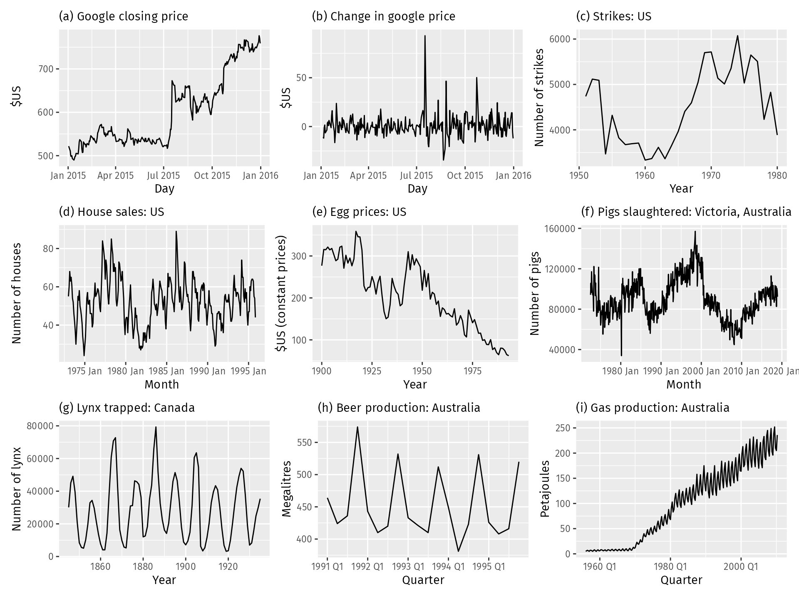
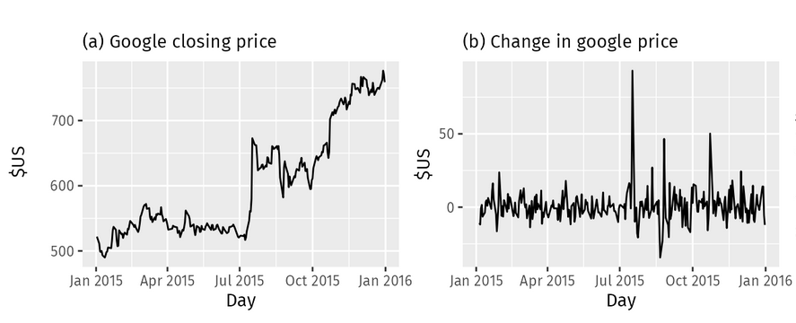
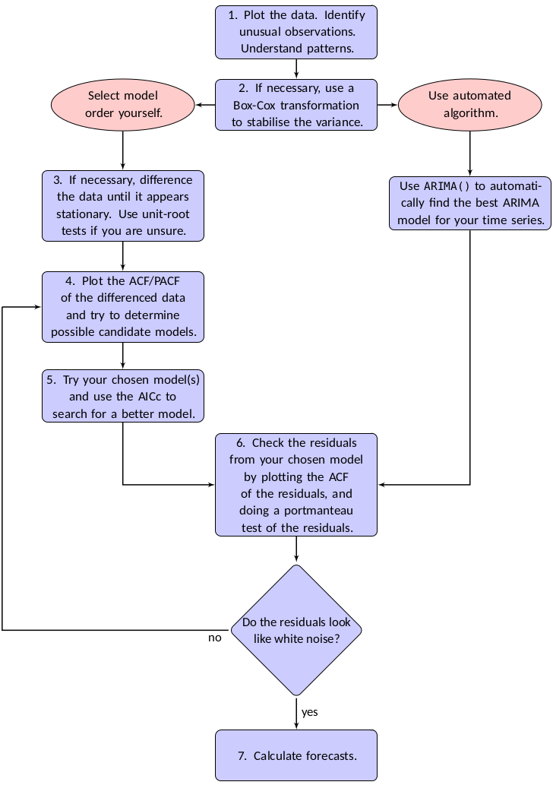

# Conceptos Fundamentales

## Proceso Estocástico

- Un **proceso estocástico** $\{Y_t\}$ es una colección de **variables aleatorias** indexadas en el tiempo.
$$
{y_1, y_2, \dots, y_T}
$$

- Considere por ejemplo una colección $T$ de valores $\varepsilon_t$ aleatorios e independientes idénticamente distribuidas

$$
{\varepsilon_1, \varepsilon_3, \dots, \varepsilon_T} \\
\varepsilon_t \sim N(0, \sigma^2)
$$

```{python}
import numpy as np
import matplotlib.pyplot as plt

t_sim = np.arange(100)  # 100 pasos
n_series = range(1, 4)     # 3 series (1, 2, 3)
random_y = {}

for i in n_series:
    y_t = []
    for t in range(len(t_sim)):
        e = np.random.normal(0, 1)
        if t == 0:
            y_t.append(e)
        else:
            y_t.append(y_t[t - 1] + e)
    random_y[f"y_{i}"] = y_t

# 2. Graficamos
fig, ax = plt.subplots(figsize=(10, 5))
for key, value in random_y.items():
    ax.plot(t_sim, value, label=key)
ax.set_title('Distintas realizaciones Y_t')
ax.set_xlabel('Tiempo')
ax.set_ylabel('y_t')
ax.legend()
ax.grid(True, alpha=0.3)
plt.show()

```

## Estacionariedad

::: {.callout-important}
La estacionariedad significa que las propiedades estadísticas (media, varianza, etc) **permanecen constantes a lo largo del tiempo**, por lo que las series temporales con tendencias o estacionalidad no son estacionarias.
:::

**¿Por qué es importante?**

::: {.incremental}
- Los modelos ARMA requieren estacionariedad
- Propiedades estadísticas constantes en el tiempo
- Permite hacer inferencia y pronóstico
:::

## ¿Qué serie es estacionaria?

{width="900px"}


## Detectar las series no estacionarias

Existen varios métodos para evaluar si una serie temporal es estacionaria o no estacionaria:

- Inspección visual de la serie temporal: inspeccionando visualmente el gráfico de la serie temporal, es posible identificar la presencia de una tendencia o estacionalidad notables. Si se observan estos patrones, es probable que la serie no sea estacionaria.

- Valores estadísticos: calcular estadísticos como la media y la varianza, de varios segmentos de la serie. Si existen diferencias significativas, la serie no es estacionaria.

- Pruebas estadísticas: utilizar test estadísticos como la prueba Dickey-Fuller aumentada o la prueba Kwiatkowski-Phillips-Schmidt-Shin (KPSS).

## Diferenciación

::: {.callout-important}
La diferenciación puede ayudar a estabilizar la media de una serie temporal eliminando cambios en el nivel de una serie temporal y, por lo tanto, eliminando (o reduciendo) la tendencia y la estacionalidad.
:::

$$
\Delta y_t = y_t - y_{t-1}
$$

- Esta es conocida como diferenciación de primer orden. Este proceso se puede repetir si es necesario hasta que se alcance la estacionariedad deseada.



### Estacionariedad Débil (o de segundo orden)

Un proceso $\{Y_t\}$ es **débilmente estacionario** si:

1. $E[Y_t] = \mu$ (constante) $\forall t$
2. $Var(Y_t) = \sigma^2$ (constante) $\forall t$
3. $Cov(Y_t, Y_{t+k}) = \gamma_k$ (solo depende del rezago $k$)

## Función de Autocorrelación (ACF)

- Además del gráfico temporal de los datos, el gráfico de la ACF también es útil para identificar series temporales no estacionarias. 
- En una serie temporal estacionaria, la ACF **se reducirá a cero con relativa rapidez**, mientras que en datos no estacionarios la ACF **disminuye lentamente**. 
- Además, para datos no estacionarios, el valor de $\rho_1$ suele ser alto y positivo.


$$
\rho_k = \frac{\gamma_k}{\gamma_0} = \frac{Cov(Y_t, Y_{t-k})}{Var(Y_t)}
$$

**Propiedades**:

- $\rho_0 = 1$
- $-1 \leq \rho_k \leq 1$
- $\rho_k = \rho_{-k}$ (simétrica)

## Función de Autocorrelación Parcial (PACF)

La **PACF** mide la correlación entre $Y_t$ y $Y_{t-k}$ eliminando el efecto de los rezagos intermedios.

$$
\phi_{kk} = Corr(Y_t, Y_{t-k} | Y_{t-1}, ..., Y_{t-k+1})
$$


## Prueba de Dickey-Fuller aumentada (ADF)

::::: {.callout-important}
La prueba Dickey-Fuller aumentada considera como hipótesis nula que la **serie temporal tiene una raíz unitaria**, una característica frecuente de las series temporales no estacionarias. 
:::

$$
\Delta y_t = \alpha + \beta t + \gamma y_{t-1} + \sum_{i=1}^{k} \delta_i \Delta y_{t-i} + \varepsilon_t
$$

- $\Delta y_t$​: Representa la primera diferencia de la serie en el tiempo t, definida como yt​−yt−1​.
- $\alpha$: Es el término constante o intercepto (drift).
- $\beta t$: Es el coeficiente de la tendencia lineal en el tiempo.
- $\gamma$: Es el coeficiente de interés principal. Se prueba la hipótesis nula H0​:$\gamma=0$ (existe raíz unitaria) frente a la alternativa H1​:$\gamma < 0$ (la serie es estacionaria).
- $\sum_{i=1}^{k} \delta_i \Delta y_{t-i}$: Son los términos de rezagos (lags) de la variable diferenciada. El propósito de estos términos es eliminar la autocorrelación en los residuos.
- $\varepsilon_t$​: Es el término de error (ruido blanco).

**Prueba de hipótesis que la serie es estacionaria.**

- Hipótesis nula (HO): La serie tiene una raíz unitaria, no es estacionaria.
- Hipótesis alternativa (HA): La serie no tiene raíz unitaria, es estacionaria.

Dado que la hipótesis nula supone la presencia de una raíz unitaria, el p-value obtenido debe ser inferior a un nivel de significación determinado, a menudo fijado en 0.05, para rechazar esta hipótesis. Este resultado indica la estacionariedad de la serie. 

## Prueba Kwiatkowski-Phillips-Schmidt-Shin (KPSS).

::::: {.callout-note}
La prueba KPSS comprueba si una serie temporal es estacionaria en torno a una media o una tendencia lineal. 
:::

$$
y_t = \xi t + r_t + \varepsilon_t
$$

- $r_t$​ es una caminata aleatoria: $r_t​=r_{t−1​}+u_t$​, donde $u_t \sim N(0,\sigma^2​)$.
- $\xi t$ es una tendencia determinista.
- $\varepsilon_t$​ es un error estacionario.

- En esta prueba, la hipótesis nula es que la serie es estacionaria. Por consiguiente, los p-values pequeños (por ejemplo, inferiores a 0.05) rechazan la hipótesis nula y sugieren que es necesario diferenciar.

## Nota acerca de KPSS y ADF

::::: {.callout-note}
 - Si bien ambas pruebas se utilizan para comprobar la estacionariedad:

- La prueba KPSS se centra en la presencia de tendencias. Un p-value bajo indica la no estacionariedad debida a una tendencia.
- La prueba ADF se centra en la presencia de una raíz unitari. Un p-value bajo indica que la serie temporal no tiene una raíz unitaria, lo que sugiere que podría ser estacionaria.

- Es habitual utilizar ambas pruebas a la vez para comprender mejor las propiedades de estacionariedad de una serie temporal. 
:::

## Modelo de caminata aleatoria

- El modelo de Caminata Aleatoria (o Random Walk) es uno de los conceptos pilares en el análisis de series de tiempo, especialmente en finanzas y econometría. Se utiliza para describir procesos donde el valor de una variable en el tiempo t depende únicamente de su valor anterior más un componente impredecible (ruido blanco).

$$
y_t = y_{t-1} + \varepsilon_t.
$$


Los modelos de caminata aleatoria se utilizan ampliamente para datos no estacionarios, en particular datos financieros y económicos. La caminata aleatoria suelen presentar:

- No Estacionariedad: Una caminata aleatoria es el ejemplo clásico de una serie no estacionaria. Su varianza aumenta con el tiempo, lo que significa que a largo plazo la serie se aleja de su origen.
- Cambios de dirección: Largos periodos de aparentes tendencias al alza o a la baja repentinos e impredecibles
- Memoria Infinita: Cada choque aleatorio εt​ persiste para siempre en el nivel de la serie. No hay un "regreso a la media".
- Raíz Unitaria: Si aplicamos la prueba de Dickey-Fuller Aumentada que vimos antes, el coeficiente "\gamma" sería igual a 0, confirmando que la serie tiene una raíz unitaria.

- Los pronósticos de un modelo $y_t$ de paseo aleatorio **son iguales a la última observación**, ya que los movimientos futuros son impredecibles y tienen la misma probabilidad de ser al alza o a la baja. Por lo tanto, el modelo de paseo aleatorio sustenta los pronósticos ingenuos.

```{python}
import numpy as np
import matplotlib.pyplot as plt

t_sim = np.arange(100)  # 100 pasos
n_series = range(1, 4)     # 3 series (1, 2, 3)
random_y = {}

for i in n_series:
    y_t = []
    for t in range(len(t_sim)):
        e = np.random.normal(0, 1)
        if t == 0:
            y_t.append(e)
        else:
            y_t.append(y_t[t - 1] + e)
    random_y[f"y_{i}"] = y_t

# 2. Graficamos
fig, ax = plt.subplots(figsize=(10, 5))
for key, value in random_y.items():
    ax.plot(t_sim, value, label=key)
ax.set_title('Distintas realizaciones de Caminata Aleatoria Y_t')
ax.set_xlabel('Tiempo')
ax.set_ylabel('y_t')
ax.legend()
ax.grid(True, alpha=0.3)
plt.show()

```

## Ejercicio 1. Identificar estacionariedad

- Descarga la serie del PIB de Colombia anual y la serie de acciones diarias de Google. A ambas vas a realizar:

- Gráfica la serie temporal.
- Calcula estadísticas descriptivas básicas.
- Realiza el ACF diagnostico de la serie.
- Realiza el test de Dickey-Fuller Aumentado (ADF) para verificar estacionariedad.
- Interpret el resultado del test ADF: ¿Es la serie estacionaria?
- Corregir si no es estacionaria con la diferenciación.

## Concepto de proceso ruido blanco

::: {.callout-note}
El ruido blanco (White Noise) representa la parte de los datos que es puramente aleatoria e impredecible. Es el "residuo ideal" que buscamos obtener después de ajustar un modelo, ya que significa que el modelo ha extraído toda la información útil de la serie de tiempo.
:::

### Definición matemática

Se dice que $\{\varepsilon_t\}$ es un proceso de **ruido blanco** si cumple:

- **Media nula:** $E[\varepsilon_t] = 0$
- **Varianza constante:** $Var(\varepsilon_t) = \sigma^2$
- **Ausencia de autocorrelación:** $\text{Corr}(\varepsilon_t, \varepsilon_{t-k}) = 0$ para todo $k \neq 0$

Si además los errores siguen una distribución normal, hablamos de **Ruido Blanco Gaussiano**:
$$
\varepsilon_t \sim \text{IID} N(0, \sigma^2)
$$

```{python}
#| fig-cap: "Serie de Ruido Blanco y su ACF (Python)"
import numpy as np
import pandas as pd 
import matplotlib.pyplot as plt
from statsmodels.graphics.tsaplots import plot_acf
from statsmodels.stats.diagnostic import acorr_ljungbox

# Generar 200 observaciones de ruido blanco gaussiano
np.random.seed(42)
white_noise = np.random.normal(0, 1, 200)

# Graficar la serie y el ACF
fig, axes = plt.subplots(1, 2, figsize=(14, 5))

# Gráfico de la serie temporal
axes[0].plot(white_noise, color='steelblue')
axes[0].set_title('Proceso de Ruido Blanco')
axes[0].axhline(0, color='red', linestyle='--', linewidth=1)

# Gráfico de Autocorrelación (ACF)
plot_acf(white_noise, ax=axes[1], lags=40)
axes[1].set_title('Autocorrelación (ACF)')

plt.tight_layout()
plt.show()

# Realizar la prueba para los primeros 10 rezagos
res = acorr_ljungbox(white_noise, lags=[10], return_df=True)
print(res)

# Estadisticos
print("-" * 30)
print(f"Media : {np.mean(white_noise)}")
print(f"Varianza : {np.var(white_noise)}")
```

# Modelos MA(q)

## MA de Primer Orden

- Sea $\varepsilon_t$ un proceso ruido blanco, definimos a MA(1) así:
$$
Y_t = \mu + \varepsilon_t + \theta \varepsilon_{t-1}
$$

- Donde $\mu$ y $\theta$ son constantes.
- $Y_t$  es construido de una suma ponderada se los 2 mas recientes valores de $\varepsilon_t$
- Este proceso es estacionario en covarianza

**Propiedades**:

- Media: $E[Y_t] = 0$
- Varianza: $Var(Y_t) = \sigma^2(1+\theta^2)$
- Autocovarianza:
    - $E(Y_t - \mu)(Y_{t-1} - \mu) = \theta \sigma^2$
    - $E(Y_t - \mu)(Y_{t-j} - \mu) = 0$ para $j > 1$
- ACF: 
  - $\rho_1 = \frac{\theta}{1+\theta^2}$
  - $\rho_k = 0$ para $k > 1$
- PACF: decaimiento exponencial

## Proceso de Medias Móviles de orden q MA(q) 

### Definición

$$Y_t = \mu + \varepsilon_t + \theta_1 \varepsilon_{t-1} + \theta_2 \varepsilon_{t-2} + ... + \theta_q \varepsilon_{t-q}$$

donde:

- $\varepsilon_t \sim WN(0, \sigma^2)$
- $\theta_1, ..., \theta_q$ son los parámetros de medias móviles
- $\mu$ es la media del proceso

::: {.callout-note}
**Interpretación**: El valor actual es una combinación lineal de shocks aleatorios actuales y pasados.
::: 

## MA(q): Propiedades Generales

**Autocorrelación**:

$$
\rho_k = \begin{cases}
\frac{\sum_{j=0}^{q-k} \theta_j \theta_{j+k}}{\sum_{j=0}^{q} \theta_j^2} & k = 1, 2, ..., q \\
0 & k > q
\end{cases}
$$

donde $\theta_0 = 1$.

**Característica**: ACF se anula después del rezago q (memoria finita).

## Identificación de MA(q)

| Característica | MA(q) |
|----------------|-------|
| **ACF** | Corte abrupto después del rezago q |
| **PACF** | Decae gradualmente (exponencial o sinusoidal) |
| **Orden** | q = último rezago significativo en ACF |

> **Regla práctica**: Si ACF tiene corte claro en rezago q y PACF decae → MA(q)


## Simulación

- Simulamos los procesos :
$$
MA(1): y_t = \epsilon_t + 0.7 * \epsilon_{t-1} \\
MA(2): y_t = \epsilon_t + 0.6 * \epsilon_{t-1} + 0.3 * \epsilon_{t-2}
$$

```{python}
import numpy as np
import pandas as pd
import matplotlib.pyplot as plt
from statsmodels.tsa.arima_process import ArmaProcess
from statsmodels.graphics.tsaplots import plot_acf, plot_pacf

def plot_proceso_ma(process, title):
    # Generar 500 muestras del proceso
    np.random.seed(42)
    data = process.generate_sample(nsample=500)
    
    fig, axes = plt.subplots(1, 3, figsize=(20, 4))
    
    # Gráfico Temporal
    axes[0].plot(data, color='teal', alpha=0.8)
    axes[0].set_title(f'Serie Temporal {title}')
    axes[0].axhline(0, color='red', linestyle='--', linewidth=1)
    
    # ACF
    plot_acf(data, ax=axes[1], lags=20, title=f'ACF {title}')
    
    # PACF
    plot_pacf(data, ax=axes[2], lags=20, title=f'PACF {title}', method='ywm')
    
    plt.tight_layout()
    plt.show()

# Nota: statsmodels usa el formato (1, theta_1, theta_2, ...) 
# para el polinomio de medias móviles.

# MA(1): y_t = epsilon_t + 0.7 * epsilon_{t-1}
ma1_params = np.array([1, 0.7])
ar1_params = np.array([1]) # Sin parte AR
process_ma1 = ArmaProcess(ar1_params, ma1_params)

# MA(2): y_t = epsilon_t + 0.6 * epsilon_{t-1} + 0.3 * epsilon_{t-2}
ma2_params = np.array([1, 0.6, 0.3])
process_ma2 = ArmaProcess(ar1_params, ma2_params)

# Ejecutar visualizaciones
plot_proceso_ma(process_ma1, "MA(1) con $\\theta=0.7$")
plot_proceso_ma(process_ma2, "MA(2) con $\\theta=[0.6, 0.3]$")

```

# Modelos AR(p)

## Modelo Autoregresivo de Orden 1 AR(1)

$$Y_t = \phi Y_{t-1} + \varepsilon_t, \quad |\phi| < 1$$

**Propiedades**:

- Media: $E[Y_t] = 0$
- Varianza: $Var(Y_t) = \frac{\sigma^2}{1-\phi^2}$
- ACF: $\rho_k = \phi^k$ (decaimiento exponencial)
- PACF: $\phi_{1,1} = \phi$, $\phi_{kk} = 0$ para $k > 1$

**Identificación**:
- ACF: decae gradualmente
- PACF: corte abrupto después del rezago 1

**Condiciones de estacionariedad**:
- Si $|\phi| < 1$ : existe un procesos estacionario para $Y_t$
- Si $|\phi| \geq 1$ : NO existe un procesos estacionario para $Y_t$ con varianzas finitas. 
- Si $\phi = 1$: camino aleatorio (no estacionario)

## AR(2)

$$
Y_t = \phi_1 Y_{t-1} + \phi_2 Y_{t-2} + \varepsilon_t
$$

**Condiciones de estacionariedad**:
1. $\phi_1 + \phi_2 < 1$
2. $\phi_2 - \phi_1 < 1$
3. $|\phi_2| < 1$

**Comportamiento de la ACF**:
- Decaimiento exponencial o sinusoidal amortiguado
- Depende de si las raíces son reales o complejas

## Simulación AR(1) y AR(2)

$$
AR(1): y_t = 0.7 * y_{t-1} + \epsilon_t \\
AR(2): y_t = 0.5 * y_{t-1} + 0.25 * y_{t-2} + \epsilon_t
$$

```{python}
import numpy as np
import pandas as pd
import matplotlib.pyplot as plt
from statsmodels.tsa.arima_process import ArmaProcess
from statsmodels.graphics.tsaplots import plot_acf, plot_pacf

def plot_proceso_ar(process, title):
    # Generar 500 muestras
    np.random.seed(42)
    data = process.generate_sample(nsample=500)
    
    fig, axes = plt.subplots(1, 3, figsize=(18, 5))
    
    # Gráfico Temporal
    axes[0].plot(data, color='darkslateblue', alpha=0.8)
    axes[0].set_title(f'Serie Temporal {title}')
    axes[0].axhline(0, color='red', linestyle='--', linewidth=1)
    
    # ACF
    plot_acf(data, ax=axes[1], lags=20, title=f'ACF {title}')
    
    # PACF
    plot_pacf(data, ax=axes[2], lags=20, title=f'PACF {title}', method='ywm')
    
    plt.tight_layout()
    plt.show()

# Nota: statsmodels usa el formato (1, theta_1, theta_2, ...) 
# para el polinomio de medias móviles.

# AR(1): y_t = 0.7 * y_{t-1} + epsilon_t
ar1_params = np.array([1, -0.7])
ma_params = np.array([1]) # Sin parte MA
process_ar1 = ArmaProcess(ar1_params, ma_params)

# AR(2): y_t = 0.5 * y_{t-1} + 0.25 * y_{t-2} + epsilon_t
ar2_params = np.array([1, -0.5, -0.25])
process_ar2 = ArmaProcess(ar2_params, ma_params)

# Ejecutar visualizaciones
plot_proceso_ar(process_ar1, "AR(1) con $\phi=0.7$")
plot_proceso_ar(process_ar2, "AR(2) con $\phi=[0.5, 0.25]$")
```

## Operador de Rezagos

- Definimos el **operador de rezago** $L$: $L Y_t = Y_{t-1}$ , $L^2 Y_t = Y_{t-2}$, $L^k Y_t = Y_{t-k}$
- El modelo AR(2) se puede escribir como:
$$
Y_t = \phi_1 Y_{t-1} + \phi_2 Y_{t-2} + \varepsilon_t \\
Y_t = \phi_1 L + \phi_2 L^2 + \varepsilon_t \\
(1 - \phi_1 L - \phi_2 L ^2) Y_t = c + \varepsilon_t
$$

**Polinomio característico**: $1 - \phi_1 z - \phi_2 z^2 = 0$
**Solución polinomio** : $1 - \phi_1 z - \phi_2 z^2 = (1 - \lambda_1  L)(1 - \lambda_2  L)$

## Condición de Estacionariedad polinomio característico

Un proceso AR(p) es **estacionario** si y solo si:

> Todas las raíces del polinomio característico $\phi(z) = 0$ están **fuera** del círculo unitario.

Equivalentemente: $|\phi_i| < 1$ para todas las raíces.

**Ejemplo AR(1)**: $Y_t = \phi Y_{t-1} + \varepsilon_t$

- Estacionario si $|\phi| < 1$
- Si $\phi = 1$: raíz unitaria. En este caso, la ecuación se convierte en una caminata aleatoria (no estacionario)

## Modelo Autoregresivo de Orden p

### Definición

$$
Y_t = c + \phi_1 Y_{t-1} + \phi_2 Y_{t-2} + ... + \phi_p Y_{t-p} + \varepsilon_t
$$

donde:

- $\varepsilon_t \sim WN(0, \sigma^2)$ (ruido blanco)
- $\phi_1, ..., \phi_p$ son los parámetros autoregresivos
- $c$ es una constante

> **Interpretación**: El valor actual de $Y_t$ depende linealmente de sus $p$ valores pasados más un shock aleatorio.

## Identificación de AR(p)

| Característica | AR(p) |
|----------------|-------|
| **ACF** | Decae gradualmente (exponencial o sinusoidal) |
| **PACF** | Corte abrupto después del rezago p |
| **Orden** | p = último rezago significativo en PACF |


> **Regla práctica**: Si PACF tiene corte claro en rezago p y ACF decae → AR(p)

# Modelos ARMA(p,q)

## Combinando AR y MA

**Definición**

$$Y_t = c + \phi_1 Y_{t-1} + ... + \phi_p Y_{t-p} + \varepsilon_t + \theta_1 \varepsilon_{t-1} + ... + \theta_q \varepsilon_{t-q}$$

**Condiciones de ARMA(p,q)**

Para que un proceso ARMA(p,q) sea válido:

1. **Estacionariedad**: Raíces de $\phi(z) = 0$ fuera del círculo unitario
2. **Invertibilidad**: Raíces de $\theta(z) = 0$ fuera del círculo unitario
3. **Parsimonia**: Priorizar un modelo sencillo, utilizando la menor cantidad de parámetros necesaria para explicar adecuadamente los datos.

## Identificación de ARMA(p,q)

| Modelo | ACF | PACF |
|--------|-----|------|
| AR(p) | Decae gradualmente | Corte en rezago p |
| MA(q) | Corte en rezago q | Decae gradualmente |
| ARMA(p,q) | Decae gradualmente | Decae gradualmente |

**Problemas**: Cuando ambas decaen, determinar p y q es más complejo.

**Soluciones**:
- Criterios de información (AIC, BIC)
- Análisis de residuos
- Prueba y error informado

---

## Criterios de Información

**AIC (Akaike Information Criterion)**:

$$AIC = -2\log(L) + 2k$$

**BIC (Bayesian Information Criterion)**:

$$BIC = -2\log(L) + k\log(n)$$

donde:

- $L$ = verosimilitud del modelo
- $k$ = número de parámetros
- $n$ = tamaño de la muestra

> **Regla**: Seleccionar el modelo con menor AIC/BIC (equilibrio ajuste-parsimonia).

## Simulación ARMA(p, q)

$$
ARMA(1, 1): y_t = 0.5*y_{t-1} + \epsilon_t + 0.7*\epsilon_{t-1} \\
ARMA(1, 2): y_t = 0.7*y_{t-1} + \epsilon_t + 0.4*\epsilon_{t-1} + 0.2*\epsilon_{t-2}
$$

```{python}
import numpy as np
import pandas as pd
import matplotlib.pyplot as plt
from statsmodels.tsa.arima_process import ArmaProcess
from statsmodels.graphics.tsaplots import plot_acf, plot_pacf

def plot_proceso_arma(process, title):
    # Generar 500 muestras del proceso
    np.random.seed(42)
    data = process.generate_sample(nsample=500)
    
    fig, axes = plt.subplots(1, 3, figsize=(18, 5))
    
    # Gráfico Temporal
    axes[0].plot(data, color='darkorange', alpha=0.8)
    axes[0].set_title(f'Serie Temporal {title}')
    axes[0].axhline(0, color='black', linestyle='--', linewidth=1)
    
    # ACF
    plot_acf(data, ax=axes[1], lags=25, title=f'ACF {title}')
    
    # PACF
    plot_pacf(data, ax=axes[2], lags=25, title=f'PACF {title}', method='ywm')
    
    plt.tight_layout()
    plt.show()

# ARMA(1, 1): y_t = 0.5*y_{t-1} + epsilon_t + 0.7*epsilon_{t-1}
ar11 = np.array([1, -0.5])  # AR: (1 - 0.5L)
ma11 = np.array([1, 0.7])   # MA: (1 + 0.7L)
process_arma11 = ArmaProcess(ar11, ma11)

# ARMA(1, 2): y_t = 0.7*y_{t-1} + epsilon_t + 0.4*epsilon_{t-1} + 0.2*epsilon_{t-2}
ar12 = np.array([1, -0.7])  # AR: (1 - 0.7L)
ma12 = np.array([1, 0.4, 0.2]) # MA: (1 + 0.4L + 0.2L^2)
process_arma12 = ArmaProcess(ar12, ma12)

# Ejecutar visualizaciones
plot_proceso_arma(process_arma11, "ARMA(1, 1)")
plot_proceso_arma(process_arma12, "ARMA(1, 2)")
```

# Modelos ARIMA

## ¿Qué son los modelos ARIMA?

- ARIMA (AutoRegressive Integrated Moving Average) son una familia de modelos **para series de tiempo estacionarias** ampliamente reconocidos y utilizados para la predicción de series temporales.

- Combinan tres componentes fundamentales:
  - **AR**: Autoregresivo (dependencia del pasado)
  - **I**: Integración (diferenciación para estacionariedad)
  - **MA**: Medias Móviles (dependencia de errores pasados)

- El elemento autorregresivo (AR) relaciona el valor actual con valores pasados (lags)
- El elemento de media móvil (MA) asume que el error de predicción es una combinación lineal de los errores de predicción pasados. 
- Por último, el componente integrado (I) indica que se han aplicado diferencias entre valores consecutivos de la serie original (y este proceso de diferenciación puede haberse realizado más de una vez).

**Notación**: ARIMA(p, d, q)

- p = orden autoregresivo
- d = orden de diferenciación
- q = orden de medias móviles

## Definición ARIMA

- Sabemos que un proceso ARMA(p, q) se define como :

$$
Y_t = c + \phi_1 Y_{t-1} + ... + \phi_p Y_{t-p} + \varepsilon_t + \theta_1 \varepsilon_{t-1} + ... + \theta_q \varepsilon_{t-q}
$$

- Ahora, **diferenciando** el proceso ARMA(p, q) tenemos el modelo ARIMA(d, p, q)
$$
y'_{t} = c + \phi_{1}y'_{t-1} + \cdots + \phi_{p}y'_{t-p}
     + \theta_{1}\varepsilon_{t-1} + \cdots + \theta_{q}\varepsilon_{t-q} + \varepsilon_{t} \\
\phi(L)(1-L)^d Y_t = c + \theta(L)\varepsilon_t
$$

- Donde $y'_{t}$ es la serie diferenciada y $L$ notación de rezago $Y_t$. El valor $c$ se le conoce como deriva, y representa el comportamiento tendencial de la serie a largo plazo.
- Para que un proceso ARIMA(p, d, q) sea válido:

1. **Estacionariedad**: Raíces de $\phi(z) = 0$ fuera del círculo unitario
2. **Invertibilidad**: Raíces de $\theta(z) = 0$ fuera del círculo unitario
3. **Parsimonia**: Priorizar un modelo sencillo, utilizando la menor cantidad de parámetros necesaria para explicar adecuadamente los datos.

### Modelos especiales 

| Modelo | Nombre | Ecuación |
|--------|--------|----------|
| ARIMA(0,0,0) sin constante | Ruido blanco | $Y_t = \varepsilon_t$ |
| ARIMA(0,1,0) sin constante | Camino aleatorio | $Y_t = Y_{t-1} + \varepsilon_t$ |
| ARIMA(0,1,0) con constante | Camino aleatorio con deriva | $Y_t = c + Y_{t-1} + \varepsilon_t$ |
| ARIMA(0,0,1) | Media movil | $Y_t = \varepsilon_t + \theta\varepsilon_{t-1}$ |
| ARIMA(1,0,0) | Autoregresivo | $Y_t =\phi \Delta Y_{t-1} + \varepsilon_{t-1}, |\phi| \le 1$ |
| ARIMA(0,1,1) | Suavizado exponencial simple | $\Delta Y_t = \varepsilon_t + \theta\varepsilon_{t-1}$ |
| ARIMA(1,1,0) | Autorregresivo integrado | $\Delta Y_t = \phi \Delta Y_{t-1} + \varepsilon_t, |\phi| \geq 1$ |

## Algoritmo de estimación modelo ARIMA(p, d, q)

- Metodología Box-Jenkins para la estimación de una ARIMA(p, d, q)

1. Grafique los datos e identifique cualquier observación inusual (valores atípicos).
2. Si es necesario, transforme los datos (utilizando una transformación de Box-Cox) para estabilizar la varianza.
3. Si los datos no son estacionarios, aplique primeras diferencias hasta que la serie sea estacionaria. Importante verificar prueba de Dickey-Fuller aumentada y Kwiatkowski-Phillips-Schmidt-Shin (KPSS). Usualmente $0 \leq d \leq 2$
4. Examine el ACF y PACF: ¿Es adecuado un modelo ARIMA(p,d,0) o un ARIMA(0,d,q)?
5. Pruebe los modelos seleccionados y utilice el Criterio de Información Akaike corregido para muestras pequeñas (AICc) para buscar un modelo mejor.
6. Verifique los residuos de su modelo elegido mediante el gráfico del ACF de los residuos y realizando una prueba Ljung-Box. Si no se comportan como ruido blanco, **intente con un modelo modificado**.
7. ***Una vez que los residuos parezcan ruido blanco, calcule los pronósticos.**

## Algoritmo ARIMA(p, d, q)

{height="900"}

- Fuente : Hyndman, R. J., & Athanasopoulos, G. (2021)

## Algoritmo Auto-ARIMA(p, d, q)

- **El proceso de seleccionar y estimar un modelo ARIMA(p, d, q) es iterativo** buscando finalmente un modelo con menor Criterio de Información Akaike (AICc) tal que sus residuos sean se comporten como ruido blanco.
$$
\varepsilon_t \sim \text{IID} N(0, \sigma^2)
$$

- Por lo anterior, existen paquetes que intentan automatizar este proceso.

1. El número de diferencias $0 \leq d \leq 2$ se determina mediante pruebas KPSS repetidas.
2. Los valores de $p$ y $q$ se eligen minimizando el AICc después de diferenciar los datos $d$ veces. En lugar de considerar cada combinación posible de $p$ y $q$, el algoritmo utiliza una búsqueda por pasos para recorrer el espacio de modelos.

**Se estiman cuatro modelos iniciales:**

- $\text{ARIMA}(0,d,0)$
- $\text{ARIMA}(2,d,2)$
- $\text{ARIMA}(1,d,0)$
- $\text{ARIMA}(0,d,1)$

3. Se incluye una constante (deriva) a menos que $d=2$. Si $d \leq 1$, también se ajusta un modelo adicional:

- $\text{ARIMA}(0,d,0)$ sin constante.

4. El mejor modelo (con el valor AICc más pequeño) ajustado en el paso **(2)** se establece como el **"modelo actual"**.

Se consideran variaciones sobre el modelo actual:

- variar $p$ y/o $q$ del modelo actual en $\pm 1$
- incluir/excluir $c$ del modelo actual.

5. El mejor modelo considerado hasta el momento (ya sea el modelo actual o una de estas variaciones) se convierte en el nuevo modelo actual.
6. Repetir el **paso 4** hasta que no se pueda encontrar un AICc más bajo.

## Esquema algoritmo Auto-ARIMA(p, d, q)

{height="500"}

- Fuente : Hyndman, R. J., & Athanasopoulos, G. (2021)

## Transformación de Box-Cox

- La transformación de Box-Cox es un método estadístico utilizado para modificar la distribución de los datos con el objetivo de que se aproximen más a una distribución normal y, especialmente en series de tiempo, para estabilizar la varianza (homocedasticidad).

- La transformación depende de un parámetro llamado $\lambda$ (lambda). Para una variable $y_t$​ (que debe ser estrictamente positiva), la transformación se define como:

$$
y(\lambda) = \begin{cases} 
\dfrac{y^\lambda - 1}{\lambda} & \text{si } \lambda \neq 0 \\[10pt] 
\ln(y) & \text{si } \lambda = 0 
\end{cases}
$$

| **Valor λ** | **Tipo de transformación** | **Ecuación** |
|:-----------:|:-------------------------:|:------------:|
| -2 | Cuadrado recíproco | $y' = \frac{1}{y^2}$ |
| -1 | Recíproco | $y' = \frac{1}{y}$ |
| -0.5 | Raíz cuadrada recíproca | $y' = \frac{1}{\sqrt{y}}$ |
| 0 | Logaritmo natural (ln y) | $y' = \ln(y)$ |
| 0.5 | Raíz cuadrada | $y' = \sqrt{y}$ |
| 1 | Sin transformación (identidad) | $y' = y$ |
| 2 | Cuadrado | $y' = y^2$ |

- La transformación logarítmica ($\lambda=0$) es la más frecuente en economía porque permite interpretar los cambios en la serie como tasas de crecimiento porcentual.

## Pronóstico

Los pronósticos puntuales se pueden calcular siguiendo estos tres pasos:

- Expande la ecuación ARIMA de modo que $y_t$​ quede en el lado izquierdo y todos los demás términos en el derecho.
- Reescribe la ecuación sustituyendo $t$ por $T+h$.
- En el lado derecho de la ecuación, sustituye las observaciones futuras por sus pronósticos, los errores futuros por cero y los errores pasados por sus residuos correspondientes.

- Para un **ARIMA(1, 1, 1)** vemos que la ecuación de pronóstico que queda así:
$$
(1 - \phi L)(1 - L)y_t = (1 + \theta L)\varepsilon_t
$$

- **Paso 1: Expandir la ecuación**
$$
(1 - L - \phi L + \phi L^2)y_t = \varepsilon_t + \theta \varepsilon_{t - 1} \\
y_t - y_{t-1} - \phi y_{t-1} + \phi  y_{t-2} = \varepsilon_t + \theta \varepsilon_{t - 1} \\
\text{Despejando para } y_t \\
y_t =  (1 + \phi)y_{t-1} - \phi  y_{t-2} + \varepsilon_t + \theta \varepsilon_{t - 1}
$$

- **Paso 2: Sustituir $t$ por $T+1$ para el primer pronóstico**
$$
y_{T+1} =  (1 + \phi) y_{T + 1 - 1 } - \phi  y_{T + 1 - 2} + \varepsilon_{T + 1 + 1} + \theta \varepsilon_{T + 1 - 1} \\
y_{T+1} =  (1 + \phi ) y_{T} - \phi  y_{T - 1} + \varepsilon_{T + 2} + \theta \varepsilon_{T}
$$

- **Paso 3: Aplicar supuestos los errores $\varepsilon_{T + h} = 0$**

El pronóstico final para un paso adelante sería:
$$
\hat{y}_{T+1|T} =  (1 + \phi ) y_{T} - \phi  y_{T - 1} + \theta \varepsilon_{T}
$$

- El término $(1 + \phi) y_{T} - \phi  y_{T-1}$ captura la inercia del crecimiento (la parte integrada y autorregresiva)
- El término $\theta \varepsilon_T$ es el ajuste de error del modelo

- **Intervalo de confianza pronóstico**
$$
\hat{y}_{T+1|T} \pm 1.96\hat{\sigma}
$$

Donde $\hat{\sigma}$ es la desviación estándar de los errores del modelo 

## Ejemplo Pronóstico

- Consideremos un ARIMA(1, 1, 1) con $\phi = 0.4$ y $\theta = -0.3$
- El valor de la serie en $T$ es 100, y $T-1$ es 98
- El error de estimación $\varepsilon_T = 2$
- El pronóstico será :
$$
y_{T+1} =  (1 + \phi) y_{T} - \phi  y_{T-1} + \theta \varepsilon_T \\
y_{T+1} =  (1 + 0.4) \times 100 - 0.4  \times 98 - 0.3 \times 2 \\
y_{T+1} =  100.2
$$

- **Pregunta :** ¿cómo cambia este cálculo si intentamos pronosticar dos pasos adelante (T+2)?

## Solución pronóstico T+2

- Reemplazamos $T+2$ por $t$ en la ecuación de pronostico de ARIMA(1, 1, 1)  así:
$$
y_t =  (1 + \phi)y_{t-1} - \phi  y_{t-2} + \varepsilon_t + \theta \varepsilon_{t - 1} \\
y_{T+2} =  (1 + \phi) y_{T + 2 - 1 } - \phi  y_{T + 2 - 2} + \varepsilon_{T + 2 + 1} + \theta \varepsilon_{T + 2 - 1} \\
y_{T+2} =  (1 + \phi ) y_{T + 1} - \phi  y_{T} + \varepsilon_{T + 3} + \theta \varepsilon_{T + 1}
$$

- Conocemos a $y_{T}$ y sabemos que $\varepsilon_{T + h} = 0$. Finalmente, el término $y_{T + 1} = \hat{y}_{T+1|T}$ por tanto la ecuación de pronóstico es :
$$
\hat{y}_{T+2|T} = (1 + \phi ) \hat{y}_{T+1|T} - \phi  y_{T} \\
\hat{y}_{T+2|T} = (1 + 0.4) \times 100.2 - 0.4 \times 100 \\
\hat{y}_{T+2|T} = 100.28
$$

## Verificación del pronóstico con python

- Para un **ARIMA(1, 1, 1)** vemos que la ecuación de pronóstico que queda así:
$$
ARIMA(1, 1, 1) : y_t =  (1 + \phi)y_{t-1} - \phi  y_{t-2} + \varepsilon_t + \theta \varepsilon_{t - 1} \\
\phi = 0.4, \theta = -0.3
$$

```{python}
import numpy as np
import pandas as pd
import matplotlib.pyplot as plt
from statsmodels.tsa.arima_process import ArmaProcess
from statsmodels.tsa.arima.model import ARIMA

ar11 = np.array([1, -0.4])  # AR: (1 - 0.4L)
ma11 = np.array([1, 0.3])   # MA: (1 - 0.3L)
arma_process = ArmaProcess(ar11, ma11)
np.random.seed(42)
datos_estacionarios = arma_process.generate_sample(nsample=100)
y = np.cumsum(datos_estacionarios)

# Modelo ARIMA estimado (incluye los errores)
modelo_arima = ARIMA(y, order = (1, 1, 1)).fit()
print(modelo_arima.summary())

print("=" * 30 + "Pronóstico" + "=" * 30)
forecast = modelo_arima.get_forecast(steps=1)
print(f"Pronóstico T+1 con statsmodels ARIMA : {forecast.predicted_mean[0]}")

resid = modelo_arima.resid
forecast_formula = (1 + 0.4 ) * y[-1] - 0.4 * y[-2] - 0.3 * resid[-1]
print(f"Pronóstico T+1 con ecuación de pronóstico : {forecast_formula}")

```

## Comparación de Modelos

**Métricas de error**:

- **MAE** (Mean Absolute Error): $\frac{1}{n}\sum|y_i - \hat{y}_i|$
- **RMSE** (Root Mean Squared Error): $\sqrt{\frac{1}{n}\sum(y_i - \hat{y}_i)^2}$
- **MAPE** (Mean Absolute Percentage Error): $\frac{100}{n}\sum\frac{|y_i - \hat{y}_i|}{|y_i|}$


## ARIMA Estacional: SARIMA

Un modelo ARIMA estacional (SARIMA) se forma incluyendo términos estacionales adicionales en los modelos ARIMA que hemos visto hasta ahora. Se escribe de la siguiente manera:

$$ARIMA(p,d,q) \times (P,D,Q)_m$$

donde:

- $(p,d,q)$ = componente no estacional
- $(P,D,Q)$ = componente estacional
- $m$ = período estacional por año (12 para mensual, 4 para trimestral)

La parte estacional del modelo consiste en términos que son similares a los componentes no estacionales del modelo, pero que involucran desplazamientos hacia atrás (backshifts) del periodo estacional.

**Ejemplo**: $ARIMA(1,1,1)(1,1,1)_4$ sin contaste para datos trimestrales (m = 4) tenemos el siguiente modelo :

$$
(1 - \phi_{1}L)(1 - \Phi_{1}L^{4}) (1 - L)(1 - L^{4})y_{t} =  (1 + \theta_{1}L)(1 + \Theta_{1}L^{4})\varepsilon_{t}.
$$

- Los términos estacionales adicionales simplemente se multiplican por los términos no estacionales.

## ACF/PACF en modelos SARIMA

- La parte estacional de un modelo AR o MA se verá reflejada en los rezagos estacionales de la PACF y la ACF. Por ejemplo, un modelo ARIMA(0,0,0)(0,0,1)12 mostrará:
  - Un pico en el rezago 12 en la ACF, pero ningún otro pico significativo;
  - Un decaimiento exponencial en los rezagos estacionales de la PACF (es decir, en los rezagos 12, 24, 36, …).

- Del mismo modo, un modelo ARIMA(0,0,0)(1,0,0)12 mostrará:
  - Un decaimiento exponencial en los rezagos estacionales de la ACF;
  - Un único pico significativo en el rezago 12 de la PACF.

- Al considerar los órdenes estacionales apropiados para un modelo ARIMA estacional, **realice la diferenciación del rezago estacional**.

$$
\Delta y_{t, 12} = y_{t, 12} - y_{t - 1, 12}
$$

- El procedimiento de modelado es casi el mismo que para los datos no estacionales, excepto que necesitamos seleccionar términos AR y MA estacionales, así como los componentes no estacionales del modelo.

## ARIMAX: Modelos con Variables Exógenas

- Los modelos de series temporales anteriores permiten incluir información proveniente de observaciones pasadas de una serie, pero no permiten incorporar otra información que también puede ser relevante. 
- Por ejemplo, los efectos de días festivos, la actividad de competidores, cambios en la legislación, la situación económica general u otras variables externas pueden explicar parte de la variación histórica y conducir a pronósticos más precisos. 

- Usualmente realizaríamos este modelo :
$$
y_t = \beta_0 + \beta_1 x_{1,t} + \dots + \beta_k x_{k,t} + \varepsilon_t \\
\varepsilon_t \sim WN
$$

## Modelo ARIMAX

- El modelo ARIMAX extiende el modelo ARIMA para incluir otras variables que mejore la capacidad del modelo en el pronóstico.

**Casos de uso**:
- Incorporar variables explicativas (precio, temperatura, etc.)
- Análisis de impacto de políticas
- Eventos especiales (días festivos)

- Sin embargo, los residuos un modelo inicial entre $y_t$ y $x_t$ tiene un problema de autocorrelación. **El modelo ARIMA explicitamente modela la autocorrelación y es aplicado en el término de error del modelo.**
- Para ello los errores del modelo entre $y_t$ y $x_t$ es reemplazado por $\eta_t$ que tiene autocorrelación.
- Esta autocorrelación es modelada por ARIMA y los errores $\varepsilon_t$ son $WN$.
$$
 y_t = \beta_0 + \beta_1 x_{1,t} + \dots + \beta_k x_{k,t} + \eta_t \\
(1-\phi_1B)(1-B)\eta_t = (1+\theta_1B)\varepsilon_t \\
\varepsilon_t \sim WN
$$

- Cuando estimamos los parámetros del modelo, necesitamos minimizar la suma de los valores de $\varepsilon_t^2$​. Si minimizamos, en cambio, la suma de los valores de $\eta_t^2$​ (que es lo que ocurriría si estimáramos el modelo de regresión ignorando las autocorrelaciones en los errores) los estimadores son inconsistentes.

::::: {.callout}
Todas las variables de un modelo de regresión con errores ARMA deben ser estacionarias antes de estimarlo. Por lo tanto, primero se debe verificar que $y_t$ y todos los predictores $x_{1,t}, \ldots, x_{k,t}$ sean estacionarios. Si se estima el modelo cuando alguna de estas variables es no estacionaria, los coeficientes obtenidos no serán estimadores consistentes (y, por lo tanto, pueden no ser significativos).
:::

## Modelo ARIMAX con rezagos

- A veces, el impacto de un predictor en un modelo de regresión no será simple ni inmediato. Por ejemplo, una campaña publicitaria puede influir en las ventas durante algún tiempo después de que finalice la campaña, y las ventas de un mes dependerán del gasto en publicidad de cada uno de los meses anteriores. 

- De manera similar, un cambio en la política de seguridad de una empresa puede reducir los accidentes de forma inmediata, pero puede tener un **efecto decreciente con el tiempo** a medida que los empleados se familiarizan con las nuevas condiciones de trabajo y prestan menos atención.

- En estas situaciones, es necesario incluir **efectos rezagados del predictor**. Supongamos que solo tenemos un predictor en nuestro modelo. Entonces, un modelo que permita efectos rezagados puede escribirse como

$$
y_t = \beta_0 + \gamma_0x_t + \gamma_1 x_{t-1} + \dots + \gamma_k x_{t-k} + \eta_t
$$

Donde $\eta_t$ es un proceso ARIMA. El número de rezago $k$ se puede definir con un criterio de información AIC en conjunto con los términos $p$ y $q$ del proceso ARIMA.

## Ejercicio 1. Pronostico del PIB de Colombia.

- Usando los datos del Banco Mundial, estime un modelo ARIMA válido acorde a la teoría entre 1960-2024. Finalmente, realice el pronostico del PIB de Colombia para los próximos 5 años.

## Ejemplo 2. Empleo mensual en el sector de ocio y hostelería en EE. UU

-  Utilizando datos mensuales de empleo en Estados Unidos para los trabajos de ocio y hospitalidad desde enero de 2001 hasta septiembre de 2019 realizar una modelización ARIMA estacional (SARIMA)

## Ejemplo 3 : El modelo macroeconómico del crecimiento del consumo en Estados Unidos

- Queremos modelar cómo cambia el consumo real (compra de bienes y servicios) de una economía según el incremento del ingreso.
$$
\Delta C_t = \beta_0 + \beta_1 \Delta Ingreso_t + \varepsilon_t
$$

- $\Delta C_t$ es el cambio porcentual en el gasto real de consumo personal.
- $Ingreso_t$​ es el cambio porcentual en el ingreso personal real disponible.

- Usar el archivo `US_change.csv` para modelar.

## Ejemplo 4 : Gasto en publicidad por televisión y cotizaciones de seguros

- Una empresa de seguro en EEUU está interesada en saber si el gasto en publicidad por televisión influye en el valor de los aportes de aseguramiento. Para ello tiene dos series de tiempo, uno con el gasto en publicidad y la otra en aportes de seguro que realiza los clientes.

## Referencias

::: {.references style="font-size: 0.7em;"}
- Hyndman, R. J., & Athanasopoulos, G. (2021). *Forecasting: Principles and Practice*. 3rd ed. OTexts. Available at: https://otexts.com/fpp3/
- Hamilton, J. D. (1994). *Time Series Analysis*. Princeton University Press.
:::
