# Prophet — Modelo de Pronóstico de Meta {background-color="#4a1942"}

## Estacionalidad compleja

- Hasta ahora, hemos considerado principalmente patrones relativamente simples, como los datos trimestrales y mensuales. 
- Sin embargo, las series temporales de mayor frecuencia suelen presentar patrones estacionales más complicados. Por ejemplo, los datos pueden tener un patrón semanal y otro anual.
- Métodos avanzados no lineales nos permiten modelar y pronósticar estos eventos.

## Estacionalidad compleja


## ¿Qué es Prophet?

- **Prophet** (Taylor & Letham, 2018) creado por Facebook es un procedimiento para pronosticar series temporales basado en un modelo aditivo donde las tendencias no lineales se ajustan con estacionalidad anual, semanal y diaria, además de los efectos de los días festivos. 
- Funciona mejor con series temporales que presentan **fuertes efectos estacionales** y varios periodos de datos históricos. 
- Prophet es robusto ante datos faltantes y cambios en la tendencia, y generalmente maneja bien los valores atípicos.

## Número de post en Facebook

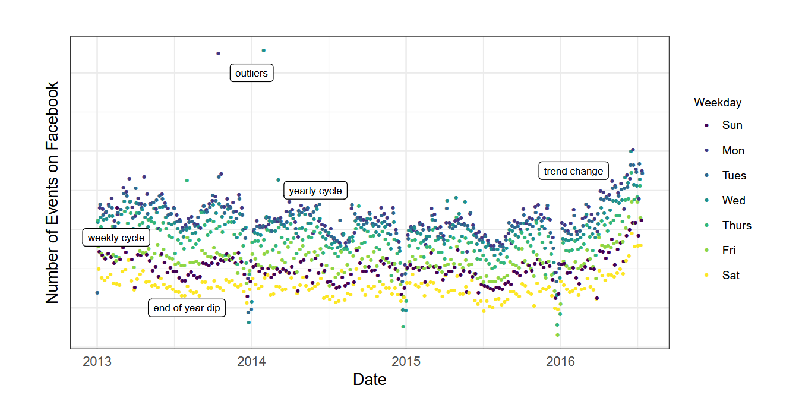

## El modelo Prophet

- Es un modelo de **descomposición aditiva** no lineal :

$$y(t) = g(t) + s(t) + h(t) + \varepsilon_t$$

| Componente | Símbolo | Descripción |
|------------|---------|-------------|
| Tendencia | $g(t)$ | Describe una tendencia lineal a trozos (o «término de crecimiento») |
| Estacionalidad | $s(t)$ | Describe los distintos patrones estacionales (diario, semanal, anual) |
| Festividades | $h(t)$ | Efectos de eventos festivos conocidos |
| Error | $\varepsilon_t$ | Término de error de ruido blanco |

## Componente de tendencia

Prophet implementa **dos modelos de tendencia**:

### 1. Crecimiento logístico (saturado)

$$g(t) = \frac{C(t)}{1 + \exp(-k(t - m))}$$

Donde $C(t)$ es la capacidad de saturación (puede ser variable), $k$ la tasa de crecimiento y $m$ el desplazamiento.

### 2. Tendencia lineal por tramos (*piecewise linear*)

$$g(t) = (k + \mathbf{a}(t)^\top \boldsymbol{\delta}) \cdot t + (m + \mathbf{a}(t)^\top \boldsymbol{\gamma})$$

Los **changepoints** son momentos donde la tendencia puede cambiar abruptamente. El modelo se estima utilizando un enfoque bayesiano para permitir la selección automática de los puntos de cambio y otras características del modelo.

## Tendencia saturada logística Prophet

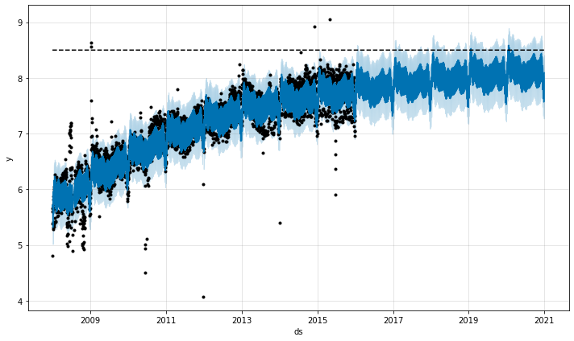

## Cambios de tendencia estimada por Prophet

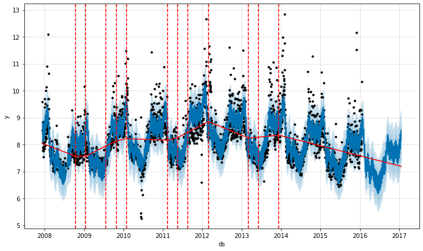

## Componente de estacionalidad

El componente estacional consiste en **términos de Fourier** de los periodos relevantes

$$s(t) = \sum_{n=1}^{N} \left[ a_n \cos\!\left(\frac{2\pi n t}{P}\right) + b_n \sin\!\left(\frac{2\pi n t}{P}\right) \right]$$

Donde $P$ es el periodo (días) y $N$ controla la flexibilidad:

| Estacionalidad | $P$ (días) | $N$ default |
|----------------|-----------|------------|
| Anual | 365.25 | 10 |
| Semanal | 7 | 3 |
| Diaria | 1 | 4 |

Los coeficientes $\{a_n, b_n\}$ se estiman con prior normal (estadística bayesiana)

## Componente de festividades

- Los efectos de las vacaciones se añaden como simples variables ficticias (dummy).

$$h(t) = \mathbf{Z}(t) \cdot \boldsymbol{\kappa}$$

Donde $\mathbf{Z}(t)$ es una matriz indicadora de si $t$ cae en una ventana de festividad, y $\boldsymbol{\kappa}$ son los efectos estimados.

Las festividades pueden tener **ventanas asimétricas**, es decir, cuántos días antes y después del evento también reciben el efecto del holiday.

| Evento       | Comportamiento real                             |
|:-------------|:------------------------------------------------|
| Black Friday | Las ventas suben desde el jueves (día anterior) |
| Cyber Monday | El efecto se extiende al martes siguiente       |
| Navidad      | La demanda aumenta varios días antes            |

## Efecto de las estacionalidad y festividades

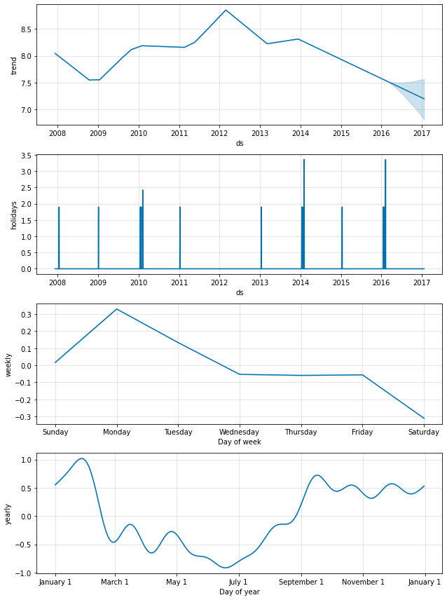

## Validación cruzada

Prophet incluye una funcionalidad para realizar validación cruzada de series temporales con el fin de medir el error de pronóstico utilizando datos históricos. Esto se lleva a cabo mediante la selección de puntos de corte (cutoff points) en el historial.

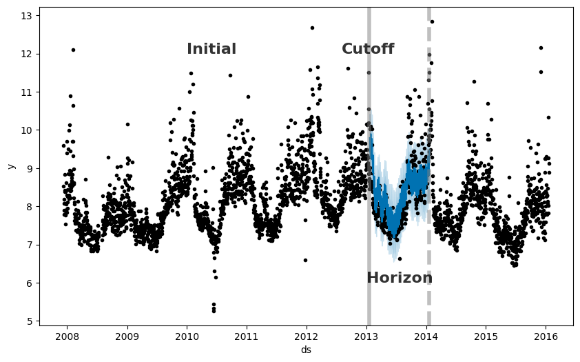

## Usar Prophet

### Python
```bash
pip install prophet pandas numpy matplotlib
```

```python
from prophet import Prophet
from prophet.diagnostics import cross_validation, performance_metrics
from prophet.plot import plot_cross_validation_metric
import pandas as pd
```

### R

```r
install.packages("prophet")

library(prophet)
library(dplyr)
library(lubridate)
```

# LSTM — Long Short-Term Memory {background-color="#0d3b66"}

## Modelos de redes neuronales

- Una red neuronal puede concebirse como una red de "neuronas" organizadas en capas. Los predictores (o entradas) forman la capa inferior, y los pronósticos (o salidas) forman la capa superior. También puede haber capas intermedias que contengan "neuronas ocultas".

::: {.columns}

::: {.column}

- Las redes más sencillas no contienen capas ocultas y equivalen a regresiones lineales.

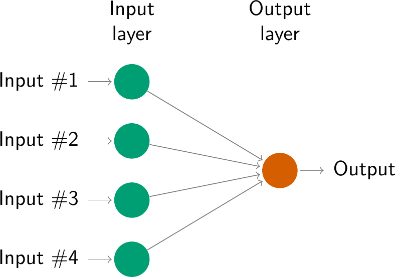

:::

::: {.column}

- Esto se conoce como _multilayer feed-forward network_ (perceptron multicapa), en la que cada capa de nodos recibe entradas de las capas anteriores. 


:::

:::

## Perceptron con función de activación sinodal

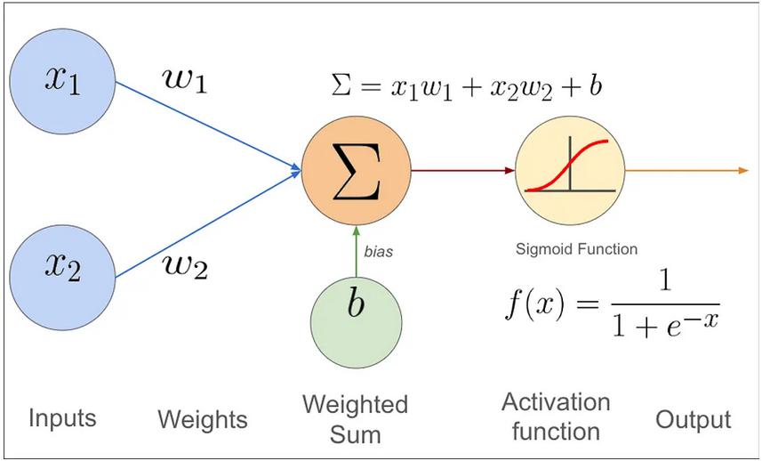

## Funciones de activación

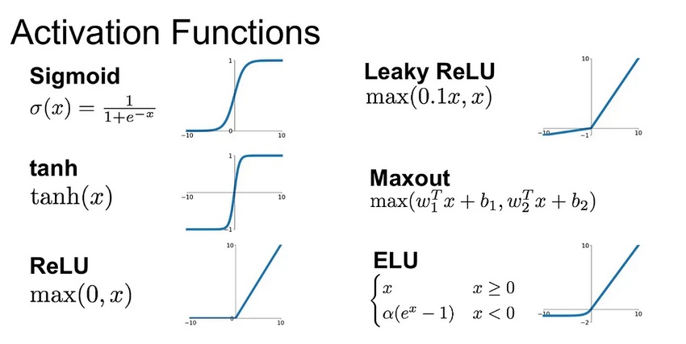

## Cómo elegir la función de activación adecuada

La elección de la función de activación depende del tipo de problema que se intenta resolver. Aquí hay algunas pautas:

### Para clasificación binaria

Utilice la **función de activación sigmoide** en la capa de salida. Esta función comprime las salidas entre 0 y 1, representando las probabilidades de las dos clases.

### Para clasificación multiclase

Utilice la **función de activación softmax** en la capa de salida. Esta función genera distribuciones de probabilidad para todas las clases.

### Si tiene dudas

Utilice la **función de activación ReLU** en las capas ocultas. ReLU es la función de activación predeterminada más común y suele ser una buena opción.

## Redes Neuronales Recurrentes (RNN)

- Una **red neuronal recurrente (RNN)** procesa secuencias iterando a través de sus elementos y manteniendo un estado que contiene información relativa a lo que ha visto hasta el momento. Es decir las RNN es un tipo de **red neuronal con un bucle interno**.

- Si pensamos la serie de tiempo $y_t$​ como una **secuencia donde cada valor depende de los anteriores**, capturar esa dependencia temporal es precisamente el propósito de las RNN.

Las **RNN** procesan secuencias manteniendo un estado oculto $h_t$:

$$h_t = \tanh(W_h \cdot h_{t-1} + W_x \cdot x_t + b)$$

$$\hat{y}_t = W_y \cdot h_t + b_y$$

## Esquema de una RNN

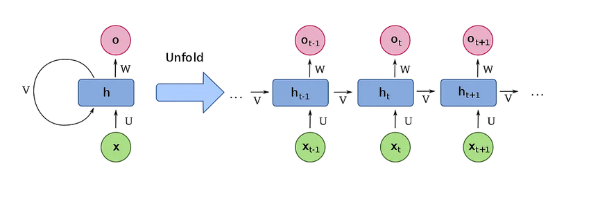

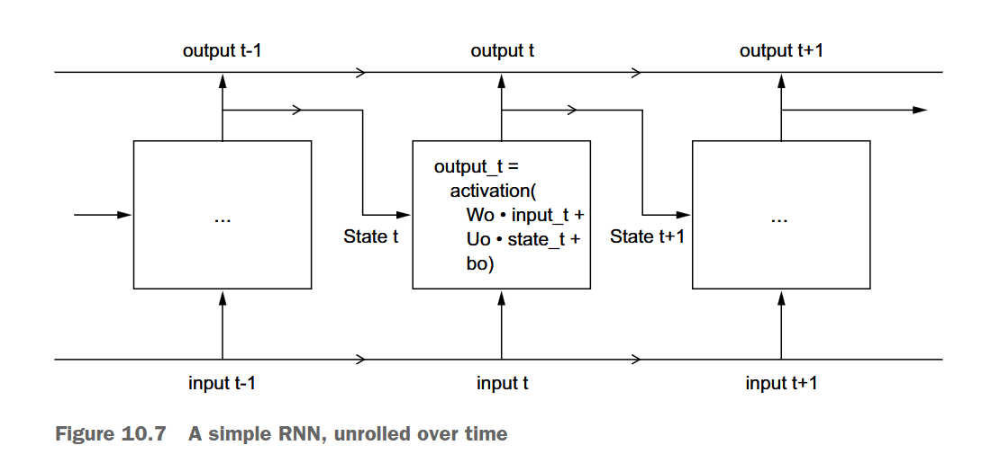

## Problema del gradiente que desaparece en RNN

- Imagina que tienes una **cadena de personas** pasando un mensaje. Cada persona modifica ligeramente el mensaje antes de pasarlo al siguiente. Después de 50 personas, el **mensaje original es irreconocible**. Eso es exactamente lo que le ocurre al gradiente en una RNN profunda.

- En secuencias largas, el gradiente $\frac{\partial L}{\partial h_1}$ tiende a **cero exponencialmente** ya que los pesos de la RNN son ajustados mediante **back-propagation**, es decir que el RNN va ajustando las estimaciones pasadas según la nueva información. Sin embargo:

$$\frac{\partial L}{\partial h_1} = \prod_{t=2}^{T} \frac{\partial h_t}{\partial h_{t-1}} \approx 0$$

- Esto impide aprender **dependencias de largo plazo**. Esto impacta series de tiempo con dependencias largas o estructuras de estacionalidad largas.

- La LSTM (Long Short-Term Memory) reemplaza la multiplicación repetida de derivadas por una **suma controlada a través de la celda de memoria** en la red.

## Arquitectura LSTM (Long Short-Term Memory)

Las LSTM introducen una **celda de memoria** $C_t$ controlada por tres compuertas:

### Compuerta de olvido

Decide qué información de la memoria anterior $C_{t-1}$ ya no es útil.
$$f_t = \sigma(W_f \cdot [h_{t-1}, x_t] + b_f)$$

### Compuerta de entrada
Decide qué información nueva del paso actual merece guardarse en la memoria.
$$i_t = \sigma(W_i \cdot [h_{t-1}, x_t] + b_i)$$

### Compuerta de salida
Decide qué parte de la memoria $C_t$​ es relevante para la predicción actual.
$$o_t = \sigma(W_o \cdot [h_{t-1}, x_t] + b_o)$$

Las puertas se activan con una **función sigmoide** $\sigma(z) = \frac{1}{1+e^{-z}}$ produce valores en $(0,1)$.

## Flujo de información en LSTM

::: {.callout-note}

Simplemente tenga en cuenta cuál es la lógica de la LSTM: **permitir que la información pasada** se almacene en una celda de memoria $C_t$ tal que los **efectos de largo plazo se mantienen**.

:::

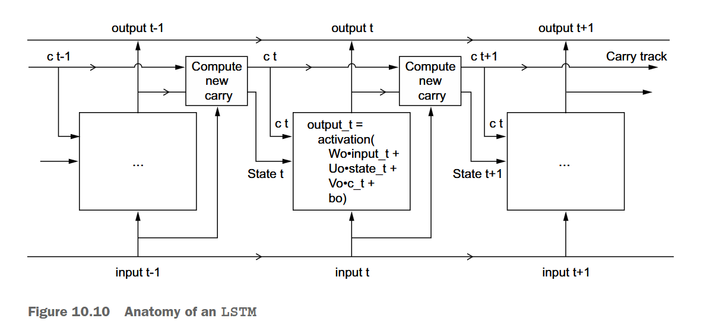

## Variantes de LSTM

| Variante | Diferencia clave |
|----------|-----------------|
| **LSTM estándar** | Arquitectura original (Hochreiter & Schmidhuber, 1997) |
| **Peephole LSTM** | Las compuertas observan directamente $C_{t-1}$ |
| **GRU** | Fusiona compuertas de olvido y entrada; sin $C_t$ separada |
| **Bidireccional LSTM** | Procesa la secuencia en ambas direcciones |
| **Stacked LSTM** | Múltiples capas LSTM apiladas |

## Uso de LSTM con Keras/TensorFlow

### Python

```bash
# Instalación
pip install tensorflow keras scikit-learn numpy pandas
```

```python
# Importaciones esenciales
import numpy as np
import pandas as pd
from tensorflow import keras
from tensorflow.keras import layers, callbacks, optimizers
from sklearn.preprocessing import MinMaxScaler
```
### R-Keras

```r
# Instalar paquetes desde CRAN
install.packages(c("keras3", "tensorflow", "tidyverse", "recipes"))

# Configurar backend de Python (ejecutar una vez)
library(keras3)
install_keras(backend = "tensorflow")  # Instala TensorFlow en el entorno Python

# Verificar instalación
library(tensorflow)
tf$constant("Hola LSTM")  # Debe retornar un tensor
```
---

# Comparación LSTM vs Prophet

| Dimensión | LSTM | Prophet |
|-----------|------|---------|
| **Paradigma** | Aprendizaje profundo | Modelo estadístico-bayesiano |
| **Interpretabilidad** | Baja (caja negra) | Alta (componentes explícitos) |
| **Datos requeridos** | Miles de observaciones | Decenas a cientos |
| **Estacionalidad** | Aprendida implícitamente | Modelada explícitamente |
| **Festividades** | Requiere features manuales | Soporte nativo |
| **Variables exógenas** | Features adicionales | `add_regressor()` |
| **Entrenamiento** | Horas (GPU recomendada) | Segundos a minutos |
| **Hiperparámetros** | Muchos y sensibles | Pocos e intuitivos |

## Aplicaciones Long Short-Term Memory (LSTM)

::: {.columns}

::: {.column}


[Colombian inflation forecast using Long Short-Term Memory approach](https://www.banrep.gov.co/en/colombian-inflation-forecast-using-long-short-term-memory-approach)

:::

::: {.column}

- Se aplican redes **LSTM** para pronosticar la inflación en Colombia a **12 meses**, comparando dos enfoques: uno univariado (solo inflación) y uno multivariado (con variables exógenas relevantes).

- El entrenamiento usa **rolling sample** con selección de hiperparámetros basada en minimización del error de pronóstico.

- El enfoque **multivariado supera** tanto al univariado como a modelos ARIMA optimizados (con y sin variables explicativas).

- La ventaja predictiva del modelo multivariado es **más pronunciada en horizontes largos**, específicamente entre el séptimo y el doceavo mes.
:::

:::


## Referencias Bibliográficas

- Hochreiter, S. & Schmidhuber, J. (1997). *Long Short-Term Memory*. Neural Computation, 9(8), 1735–1780.
- Graves, A. (2013). *Generating Sequences With Recurrent Neural Networks*. arXiv:1308.0850.
- Taylor, S.J. & Letham, B. (2018). *Forecasting at Scale*. The American Statistician, 72(1), 37–45.
- Meta Research. *Prophet Documentation*: [facebook.github.io/prophet](https://facebook.github.io/prophet)
- Chollet, F. et al. *Keras Documentation*: [keras.io](https://keras.io)
- Abadi, M. et al. *TensorFlow*: [tensorflow.org](https://www.tensorflow.org)
- Allaire, J. & Chollet, F. *R Interface to Keras*: [keras3.posit.co](https://keras3.posit.co)
